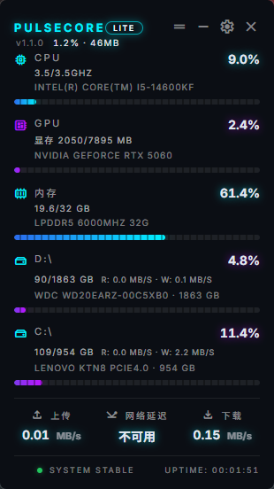
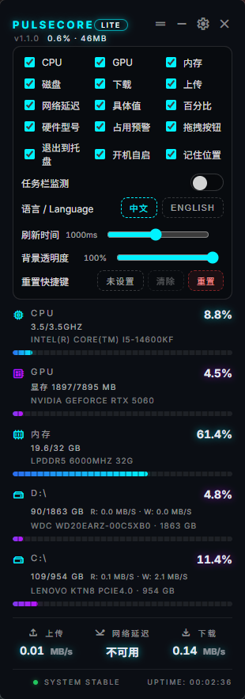
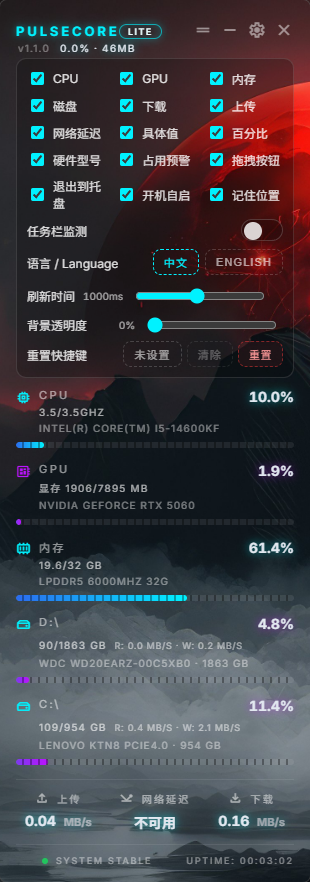
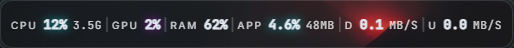
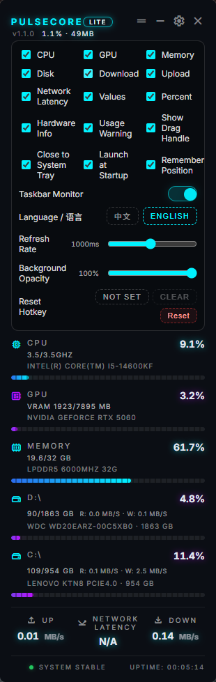
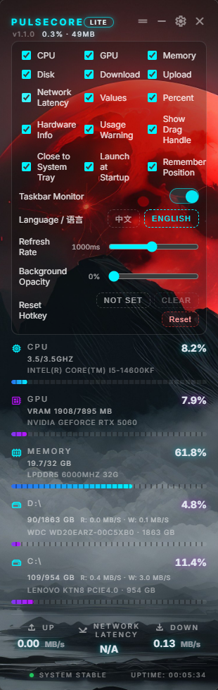

[中文文档](#中文文档) | [English Documentation](#english-documentation) | [下载地址](https://github.com/Slocean/PulseCoreLite/releases)

# PulseCore Lite v1.6.0 

PulseCoreLite 是一个基于 Tauri 2 + Vue 3 的桌面性能监控应用，提供悬浮窗监控与任务栏监控两种形态，实时展示 CPU、GPU、内存、磁盘与网络等指标，并支持多语言、透明度与刷新率配置、自动启动与托盘行为等系统级能力。

## 中文文档

### 产品概览

- 形态：悬浮窗（主窗口）+ 任务栏监控条（独立窗口）
- 目的：在最小占用前提下，持续提供硬件与网络实时指标
- 平台：Windows（自动启动、任务栏位置、卸载能力基于 Windows API）

### 版本更新 v1.6.0

- 拆分为独立 taskbar / toolkit 入口，实现三窗口独立打包并懒加载主窗口以降低内存占用
- 移除多窗口角色分支，统一使用 CompactOverlayPage，简化启动流程并清理未使用字体引用
- 主题图片处理升级：统一数据 URL 解析与预览，保存时规范化并清理无用引用
- 任务栏右键菜单增强：支持显示/隐藏主窗口，并新增“隐藏主窗口”项
- 托盘管理优化：移除“关闭时最小化到托盘”，新增托盘接力与跨窗口保证逻辑
- 新增“全屏自动隐藏任务栏”功能，支持配置持久化与 800ms 轮询检测
- 升级版本号至 1.6.0 并同步前端与 Tauri 配置

### 页面截图（中文）

<table style="border:none;border-collapse:collapse;">
  <tr>
    <th style="border:none;">主页面</th>
    <th style="border:none;">设置面板</th>
    <th style="border:none;">透明模式</th>
  </tr>
  <tr>
    <td style="border:none;"></td>
    <td style="border:none;"></td>
    <td style="border:none;"></td>
  </tr>
  <tr>
    <th style="border:none;">任务栏监控</th>
    <th style="border:none;">任务栏设置</th>
    <th style="border:none;"></th>
  </tr>
  <tr>
    <td style="border:none;"></td>
    <td style="border:none;"></td>
    <td style="border:none;"></td>
  </tr>
</table>

### 功能点

- 悬浮窗监控：CPU、GPU、内存、磁盘使用率与网络上下行
- 指标细节：CPU 频率/温度、GPU 频率/显存、内存使用量
- 硬件信息：CPU/GPU/内存/磁盘型号与规格显示
- 预警表现：高负载下的高亮色阶提示
- 交互能力：拖拽移动、双击交互、透明度可调
- 任务栏监控条：可常驻置顶、可右键快速切换显示项
- 工具箱：定时关机与系统工具能力
- 系统能力：自动启动、托盘集成、记住窗口位置
- 语言支持：中文/英文切换
- 数据刷新：采样刷新率可配置
- 工厂重置：可通过快捷键清空本地设置并重启

### 设置说明（悬浮窗配置面板）

- CPU / GPU / 内存 / 磁盘 / 下载 / 上传 / 网络延迟：是否显示对应模块
- 具体值：显示详细数值（频率、温度、读写等）
- 百分比：显示使用率百分比
- 硬件型号：显示硬件型号与规格信息
- 占用预警：高负载时改变颜色提示
- 拖拽按钮：仅通过拖拽按钮移动窗口
- - 开机自启：系统启动时自动运行
- 记住位置：记住悬浮窗与任务栏条的拖拽位置
- 任务栏监测：开启/关闭任务栏监控条
- 语言 / Language：中英切换
- 刷新时间：100~2000ms，步进 100ms
- 背景透明度：0~100%，步进 5%
- 重置快捷键：设置/清除工厂重置快捷键
- 重置：清空本地设置（localStorage）并重启

### 任务栏监控交互

- 左键拖动：移动任务栏监控条
- 双击：唤起主悬浮窗
- 右键菜单：开关各指标、常驻置顶、记住位置、关闭任务栏监控

### 用法说明

#### 安装依赖

```bash
npm install
```

#### 前端开发（浏览器）

```bash
npm run dev
```

#### Tauri 开发（桌面）

```bash
npm run tauri:dev
```

#### 前端构建

```bash
npm run build
```

#### Tauri 构建

```bash
npm run tauri:build
```

#### Windows 一键打包

```bash
npm run pack:release
```

### 技术细节

- 前端框架：Vue 3 + Vite + Pinia + Vue I18n
- 桌面框架：Tauri 2
- 后端语言：Rust
- 指标采集：sysinfo + Windows PowerShell/PerfCounter + DXGI
- 进程采样：Windows 进程树聚合应用及子进程 CPU/内存
- 数据流：Rust 采样 → Tauri 事件 → 前端 Pinia 更新 → UI 渲染
- 刷新控制：前端设置刷新率，后端循环按 rate 采样
- 多窗口：主窗口 label=main，任务栏窗口 label=taskbar，工具箱窗口 label=toolkit
- 开发端口：默认 9000（自动检测切换）
- 本地存储：
  - pulsecorelite.settings：系统级设置
  - pulsecorelite.overlay_prefs：悬浮窗显示偏好
  - pulsecorelite.taskbar_prefs：任务栏显示偏好
  - pulsecorelite.overlay_pos / pulsecorelite.taskbar_pos：窗口位置
  - pulsecorelite.refresh_rate：刷新频率

### 源码用法（关键入口）

- 应用入口：[main.ts](file:///d:/PROJECT/PulseCore/src/main.ts)
- 视图入口：[App.vue](file:///d:/PROJECT/PulseCore/src/App.vue)
- 悬浮窗页面：[index.vue](file:///d:/PROJECT/PulseCore/src/pages/index.vue)
- 任务栏页面：[taskbar.vue](file:///d:/PROJECT/PulseCore/src/pages/taskbar.vue)
- 配置面板：[OverlayConfigPanel.vue](file:///d:/PROJECT/PulseCore/src/components/OverlayConfigPanel.vue)
- 指标计算：[useOverlayMetrics.ts](file:///d:/PROJECT/PulseCore/src/composables/useOverlayMetrics.ts)
- 悬浮窗偏好：[useOverlayPrefs.ts](file:///d:/PROJECT/PulseCore/src/composables/useOverlayPrefs.ts)
- 任务栏偏好：[useTaskbarPrefs.ts](file:///d:/PROJECT/PulseCore/src/composables/useTaskbarPrefs.ts)
- 应用状态：[app.ts](file:///d:/PROJECT/PulseCore/src/stores/app.ts)
- Tauri API 封装：[tauri.ts](file:///d:/PROJECT/PulseCore/src/services/tauri.ts)
- 后端采集循环：[app.rs](file:///d:/PROJECT/PulseCore/src-tauri/src/app.rs)
- 指标采集器：[system_collector.rs](file:///d:/PROJECT/PulseCore/src-tauri/src/core/collectors/system_collector.rs)
- 硬件信息收集：[device_info/mod.rs](file:///d:/PROJECT/PulseCore/src-tauri/src/core/device_info/mod.rs)
- IPC 命令定义：[commands.rs](file:///d:/PROJECT/PulseCore/src-tauri/src/ipc/commands.rs)

## English Documentation

### Overview

- Form factors: floating overlay (main window) + taskbar monitor bar (separate window)
- Goal: continuous, low-overhead telemetry for core hardware and network stats
- Platform: Windows (autostart, taskbar position, uninstall are Windows API based)

### Release Notes v1.6.0

- Split taskbar/toolkit into dedicated entry points for three-window packaging and lazy-load the main window to reduce memory
- Standardize on CompactOverlayPage and remove multi-window role branches and unused font imports
- Improve theme image handling with unified data-URL resolution, preview support, normalization, and cleanup of unused references
- Enhance taskbar context menu to show/hide the main window, including a dedicated "Hide Main Window" action
- Optimize tray management by removing close-to-tray option and adding cross-window tray handoff/ensure logic
- Add auto-hide taskbar on fullscreen with persisted setting and 800 ms polling
- Bump and sync version to 1.6.0 (frontend + Tauri)

### Screenshots (English)

<table style="border:none;border-collapse:collapse;">
  <tr>
    <th style="border:none;">Main Page</th>
    <th style="border:none;">Settings Panel</th>
    <th style="border:none;">Transparent Mode</th>
  </tr>
  <tr>
    <td style="border:none;"></td>
    <td style="border:none;"></td>
    <td style="border:none;"></td>
  </tr>
  <tr>
    <th style="border:none;">Taskbar Monitor</th>
    <th style="border:none;">Taskbar Settings</th>
    <th style="border:none;"></th>
  </tr>
  <tr>
    <td style="border:none;"></td>
    <td style="border:none;"></td>
    <td style="border:none;"></td>
  </tr>
</table>

### Features

- Overlay metrics: CPU, GPU, memory, disks, network down/up
- Detail labels: CPU frequency/temperature, GPU frequency/VRAM, memory usage
- Hardware info: CPU/GPU/RAM/disk model and spec strings
- Usage warning: color tiers for high utilization
- Interactions: drag, double-click, adjustable background opacity
- Taskbar monitor bar: always-on-top support and quick toggles
- Toolkit: scheduled shutdown and system utilities
- System options: autostart, system tray integration, remember window position
- Localization: Chinese and English UI
- Refresh control: configurable sampling rate
- Factory reset: hotkey clears local data and reloads

### Settings (Overlay Config Panel)

- CPU / GPU / Memory / Disk / Download / Upload / Latency: toggle each module
- Values: show detailed values (freq/temp/IO)
- Percent: show usage percent
- Hardware Info: show model/spec strings
- Usage Warning: highlight on high utilization
- Drag Handle: use the handle to move the window
- - Launch at Startup: autostart on Windows
- Remember Position: persist overlay/taskbar window position
- Taskbar Monitor: enable/disable taskbar bar
- Language: Chinese/English switch
- Refresh Rate: 100~2000ms, step 100ms
- Background Opacity: 0~100%, step 5%
- Reset Hotkey: set/clear factory reset hotkey
- Reset: clear localStorage and reload

### Taskbar Monitor Interactions

- Drag: move the taskbar bar
- Double-click: show the main overlay window
- Right-click: toggle metrics, always-on-top, remember position, close taskbar monitor

### Usage

#### Install dependencies

```bash
npm install
```

#### Frontend dev (browser)

```bash
npm run dev
```

#### Tauri dev (desktop)

```bash
npm run tauri:dev
```

#### Frontend build

```bash
npm run build
```

#### Tauri build

```bash
npm run tauri:build
```

#### Windows packaging

```bash
npm run pack:release
```

### Technical Details

- Frontend: Vue 3 + Vite + Pinia + Vue I18n
- Desktop: Tauri 2
- Backend: Rust
- Telemetry: sysinfo + PowerShell/PerfCounter + DXGI (Windows)
- Process sampling: Windows process tree aggregation for app + child CPU/memory
- Data flow: Rust sampling → Tauri events → Pinia store → UI render
- Refresh control: front-end sets refresh rate, backend loop respects it
- Window roles: main overlay (label=main), taskbar bar (label=taskbar), toolkit window (label=toolkit)
- Dev port: default 9000 with auto-detection and fallback
- Local storage keys:
  - pulsecorelite.settings
  - pulsecorelite.overlay_prefs
  - pulsecorelite.taskbar_prefs
  - pulsecorelite.overlay_pos / pulsecorelite.taskbar_pos
  - pulsecorelite.refresh_rate

### Source Guide

- App entry: [main.ts](file:///d:/PROJECT/PulseCore/src/main.ts)
- Root view: [App.vue](file:///d:/PROJECT/PulseCore/src/App.vue)
- Overlay page: [index.vue](file:///d:/PROJECT/PulseCore/src/pages/index.vue)
- Taskbar page: [taskbar.vue](file:///d:/PROJECT/PulseCore/src/pages/taskbar.vue)
- Config panel: [OverlayConfigPanel.vue](file:///d:/PROJECT/PulseCore/src/components/OverlayConfigPanel.vue)
- Metrics pack: [useOverlayMetrics.ts](file:///d:/PROJECT/PulseCore/src/composables/useOverlayMetrics.ts)
- Overlay prefs: [useOverlayPrefs.ts](file:///d:/PROJECT/PulseCore/src/composables/useOverlayPrefs.ts)
- Taskbar prefs: [useTaskbarPrefs.ts](file:///d:/PROJECT/PulseCore/src/composables/useTaskbarPrefs.ts)
- App store: [app.ts](file:///d:/PROJECT/PulseCore/src/stores/app.ts)
- Tauri bridge: [tauri.ts](file:///d:/PROJECT/PulseCore/src/services/tauri.ts)
- Backend loop: [app.rs](file:///d:/PROJECT/PulseCore/src-tauri/src/app.rs)
- Collector: [system_collector.rs](file:///d:/PROJECT/PulseCore/src-tauri/src/core/collectors/system_collector.rs)
- Hardware info: [device_info/mod.rs](file:///d:/PROJECT/PulseCore/src-tauri/src/core/device_info/mod.rs)
- IPC commands: [commands.rs](file:///d:/PROJECT/PulseCore/src-tauri/src/ipc/commands.rs)
