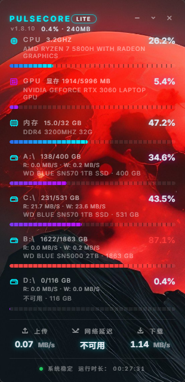
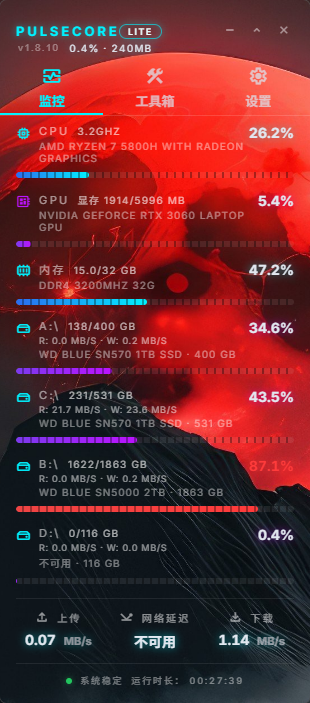
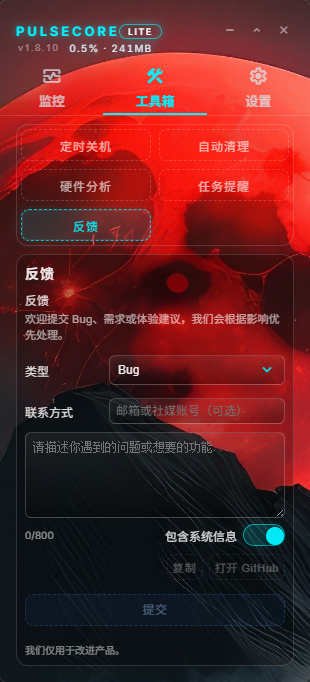
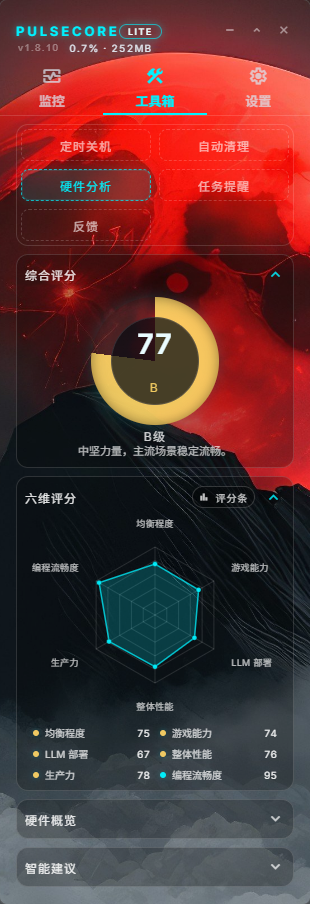
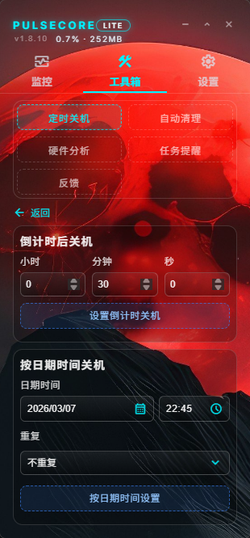
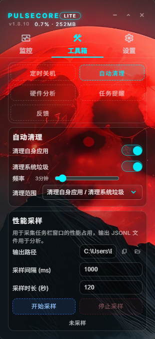
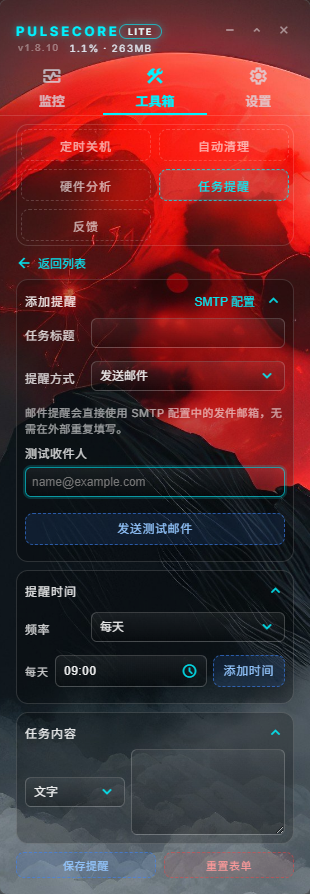
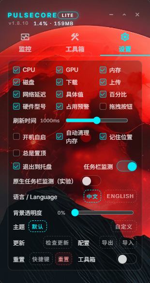
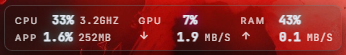
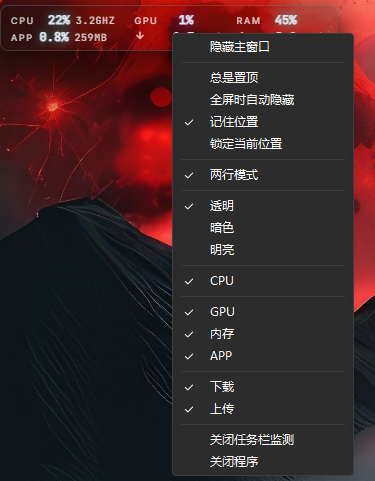

# PulseCoreLite

> Professional bilingual engineering documentation for PulseCoreLite (Windows desktop performance overlay and toolkit).
>
> PulseCoreLite 的专业双语工程文档（Windows 桌面性能悬浮层与工具套件）。

## 1. Project Positioning | 项目定位

**EN**  
PulseCoreLite is a high-performance desktop observability and operations client built with a modern Web + Native hybrid stack. It provides real-time telemetry visualization, taskbar monitoring, shutdown automation, reminder workflows, profile capture, and system-level window/control capabilities.

**ZH**  
PulseCoreLite 是一个面向桌面端可观测性与运维场景的高性能客户端，采用现代 Web + Native 混合架构，提供实时遥测可视化、任务栏监控、关机计划、任务提醒、性能采样以及系统级窗口控制能力。

## 2. Technical Stack | 技术栈

### Frontend | 前端
- `Vue 3.5` + `TypeScript`
- `Pinia` (state domain modeling)
- `vue-i18n` (built-in `zh-CN` / `en-US`)
- `Vite 6` multi-entry build (`main`, `taskbar`, `toolkit`)
- UI tokenized CSS architecture (`src/styles/tokens/*`)

### Desktop Native Runtime | 原生桌面运行时
- `Tauri 2.5` (Rust host + WebView)
- Plugins: `dialog`, `process`, `updater`
- Windows integration via `windows-sys` / `windows` APIs

### Backend (Rust) | 原生后端（Rust）
- `tokio` async runtime
- `sysinfo` hardware/system telemetry collection
- `tracing` + `tracing-subscriber` diagnostics
- `lettre` SMTP email delivery
- Persistent JSON state under app data directory

### Engineering Toolchain | 工程工具链
- `ESLint` + `vue-tsc`
- `Vitest` (unit/spec tests)
- Release packaging via `tauri build` + PowerShell scripts

## 3. Core Features | 核心功能

| Domain | Capabilities |
|---|---|
| Real-time Overlay | CPU/GPU/RAM/Disk/Network telemetry display, warning policy, topmost control, auto-hide on fullscreen |
| Taskbar Monitor | Native taskbar aligned monitoring window and sync state linkage |
| Toolkit | Hardware panel, reminder panel, scheduled shutdown, cleanup/feedback modules |
| Reminder System | Daily/weekly/monthly rules, fullscreen reminder screen, email channel, SMTP config |
| Power Operations | Countdown/once/repeat shutdown plans (Windows `shutdown` + `schtasks`) |
| Profile Capture | Timed telemetry sampling, profile file output, folder quick-open |
| Deployment | Portable/installed mode detection, updater integration, uninstall flow |
| UX Infrastructure | Multi-window controller, sync bus, persistent settings + themes, bilingual localization |

## 4. Runtime Architecture | 运行时架构

```mermaid
flowchart LR
  subgraph UI[Vue Multi-Window UI]
    A[Overlay main]\nindex.html
    B[Taskbar]\ntaskbar.html
    C[Toolkit]\ntoolkit.html
  end

  subgraph FE[TypeScript Services/Stores]
    D[tauriApi Facade]
    E[Pinia Domain Stores]
    F[Composables / Scheduler / Theme Manager]
  end

  subgraph IPC[Tauri IPC Layer]
    G[invoke commands]
    H[event emit/listen]
  end

  subgraph RS[Rust Core]
    I[AppState + loops]
    J[Telemetry collector]
    K[Reminder + Email + Shutdown]
    L[Window/Taskbar/Registry integration]
  end

  subgraph OS[Windows APIs / OS Services]
    M[Registry]
    N[schtasks + shutdown]
    O[Window manager]
  end

  A --> D
  B --> D
  C --> D
  D --> G
  F --> H
  G --> I
  I --> J
  I --> K
  I --> L
  L --> M
  K --> N
  L --> O
  E --> A
  E --> B
  E --> C
```

## 5. Codebase Topology | 代码分层

```text
src/
  entries/           # app bootstrap + window entries
  pages/             # page-level compositions
  components/        # overlay/taskbar/toolkit/ui components
  composables/       # business hooks (metrics, reminders, updater, themes, windows)
  services/          # tauri api adapters, sync bus, storage repository, window manager
  stores/            # pinia domain stores
  i18n/              # en-US / zh-CN locale packs
  styles/            # tokenized CSS + domain styles

src-tauri/
  src/ipc/commands.rs # tauri command surface
  src/app.rs          # invoke registration + background loops
  src/core/           # collectors + device info
  src/native_taskbar.rs
  src/state.rs
```

## 6. Product Pictures | 产品图

Design assets are maintained in `design/product_picture/new`.

### Gallery

| # | Preview |
|---|---|
| 1 |  |
| 2 |  |
| 3 |  |
| 4 |  |
| 5 |  |
| 6 |  |
| 7 |  |
| 8 |  |
| 9 |  |
| 10 |  |
| 11 |  |

## 7. Build, QA, and Release | 构建、质量与发布

### Development
```bash
npm install
npm run tauri:dev
```

### Quality Gates
```bash
npm run lint
npm run typecheck
npm run test
npm run check
```

### Production Build
```bash
npm run build
npm run tauri:build
```

### Release Packaging
```bash
npm run pack:release
npm run release
```

## 8. Engineering Characteristics | 工程特性

- Clear separation between UI domain logic and native host commands.
- Multi-window architecture with synchronized state/event propagation.
- Persistent configuration domain with schema-versioned storage keys.
- System-level Windows integration (autostart, topmost z-order, taskbar geometry, uninstall flow).
- Operational feature set oriented to real user workflows (shutdown scheduling, reminders, profile capture).

## 9. Platform Notes | 平台说明

- Primary target: **Windows desktop**.
- Some commands are conditionally available only on Windows (autostart, schtasks/shutdown, registry/uninstall, certain system dialogs).
- Update endpoint is configured to GitHub Releases metadata (`latest.json`).

## 10. Versioning | 版本一致性

- Current frontend package version: `1.8.10` (`package.json`)
- Tauri app version sync is enforced by `npm run sync:tauri-version`.

## 11. IPC Command Surface (Tauri) | IPC 命令面（Tauri）

### System / Window
- `get_initial_state`
- `toggle_overlay`
- `set_window_system_topmost`
- `is_fullscreen_window_active`
- `get_taskbar_info`
- `configure_native_taskbar_monitor`
- `exit_app`

### Performance / Telemetry
- `get_hardware_info`
- `set_refresh_rate`
- `set_memory_trim_enabled`
- `set_memory_trim_system_enabled`
- `set_memory_trim_interval`
- `start_profile_capture`
- `stop_profile_capture`
- `get_profile_status`
- `get_profile_output_dir`
- `open_profile_output_path`

### Reminder / Mail
- `get_task_reminder_store`
- `save_task_reminder_store`
- `trigger_task_reminder_now`
- `force_close_reminder_screens`
- `send_reminder_email`

### Operations / Lifecycle
- `get_auto_start_enabled`
- `set_auto_start_enabled`
- `get_installation_mode`
- `uninstall_app`
- `get_shutdown_plan`
- `schedule_shutdown`
- `cancel_shutdown_schedule`
- `save_export_config`
- `confirm_factory_reset`

### Diagnostics
- `debug_log`

## 12. Background Runtime Loops | 后台循环机制

- Telemetry loop: continuously refreshes snapshots for UI consumers.
- Memory trim loop: periodically executes app/system memory trimming strategy.
- Task reminder loop: evaluates schedule rules and triggers fullscreen/email channels.

---

## License | 许可

No explicit open-source license file is currently present in repository root. Add a `LICENSE` file if external distribution is required.
